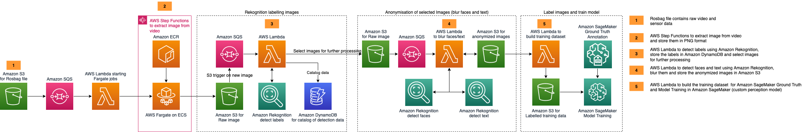

# 参考架构



英文原版 Blog ： [building-an-automated-image-processing-and-model-training-pipeline-for-autonomous-driving](https://aws.amazon.com/cn/blogs/architecture/field-notes-building-an-automated-image-processing-and-model-training-pipeline-for-autonomous-driving/)


# 1.环境配置
设置Cloud9
* 设置并绑定 Instance Profile 角色
* 清理临时 Credentials

```
echo "config region"
aws configure set region $(curl -s http://169.254.169.254/latest/meta-data/placement/region)

echo "install packages"
sudo yum install jq wget -y

echo "remove temp credentials"
rm -vf ${HOME}/.aws/credentials
```


# 2.部署步骤

## 2.1 准备代码
```
cd ~/environment

echo "clone code from github"
git clone https://github.com/auto-bwcx-me/aws-autonomous-driving-data-lake-image-extraction-pipeline-from-ros-bagfiles.git

cd aws-autonomous-driving-data-lake-image-extraction-pipeline-from-ros-bagfiles
```


设置Cloud9磁盘空间
```
# sh resize-ebs.sh 1000

sh resize-ebs-nvme.sh 1000
```


## 2.2 设置区域
在开始之前，需要设定 Region，如果没有设定的话，默认使用新加坡区域 （ap-southeast-1）
```
# sh 00-define-region.sh ap-southeast-1

sh 00-define-region.sh
```


## 2.3 准备环境
```
pip install --upgrade pip

python3 -m venv .env

pip3 install -r requirements.txt
```


## 2.4 安装CDK
```
npm install -g aws-cdk --force

cdk --version
```


创建 ECR 存储库： `rosbag-images-extract`
```
aws ecr create-repository --repository-name rosbag-images-extract
```


如果是第一次运行CDK，可以参考 [CDK官方文档](https://docs.aws.amazon.com/cdk/v2/guide/bootstrapping.html)，或者执行如下注释了的代码
```
# cdk bootstrap aws://$(curl -s http://169.254.169.254/latest/dynamic/instance-identity/document/ |jq -r .accountId)/$(curl -s http://169.254.169.254/latest/meta-data/placement/region)

cdk bootstrap
```


## 2.5 CDK部署
```
bash deploy.sh deploy true
```

注意：这个部署过程有个确认过程，不能直接启动部署就走开哦，要确认部署才能走开。


# 3.准备数据
请确保 CDK 全部部署成功（大概需要15-20分钟），然后再在 Cloud9 上执行这些操作。
```
# get s3 bucket name
s3url="https://auto-bwcx-me.s3.ap-southeast-1.amazonaws.com/my-vsi-rosbag-stack-srcbucket"
echo "Download URL is: ${s3url}"
s3bkt=$(aws s3 ls |grep rosbag-images-extract-srcbucket |awk '{print $3}')
echo "S3 bucket is: ${s3bkt}"


# create saving directory
cd ~/environment
mkdir -p ./auto-data/{industry,test1,test2}


# download testing files
wget ${s3url}/industry-kit/v1/2020-10-05-11-11-58_1.bag -O ./auto-data/industry/2020-10-05-11-11-58_1.bag
wget ${s3url}/industry-kit/v1/test_file_2GB_2021-07-14-12-00-00_1.bag -O ./auto-data/industry/test_file_2GB_2021-07-14-12-00-00_1.bag
wget ${s3url}/industry-kit/v1/test_file_7GB_2021-07-14-12-30-00_1.bag -O ./auto-data/industry/test_file_7GB_2021-07-14-12-30-00_1.bag
wget ${s3url}/test-vehicle-01/072021/2020-11-19-22-21-36_1.bag -O ./auto-data/test1/2020-11-19-22-21-36_1.bag
wget ${s3url}/test-vehicle-02/072021/2020-11-19-22-21-36_1.bag -O ./auto-data/test2/2020-11-19-22-21-36_1.bag


# upload testing file
aws s3 cp ./auto-data/industry/2020-10-05-11-11-58_1.bag s3://${s3bkt}/industry-kit/v1/2020-10-05-11-11-58_1.bag
aws s3 cp ./auto-data/industry/test_file_2GB_2021-07-14-12-00-00_1.bag s3://${s3bkt}/industry-kit/v1/test_file_2GB_2021-07-14-12-00-00_1.bag
aws s3 cp ./auto-data/industry/test_file_7GB_2021-07-14-12-30-00_1.bag s3://${s3bkt}/industry-kit/v1/test_file_7GB_2021-07-14-12-30-00_1.bag
aws s3 cp ./auto-data/test1/2020-11-19-22-21-36_1.bag s3://${s3bkt}/test-vehicle-01/072021/2020-11-19-22-21-36_1.bag
aws s3 cp ./auto-data/test2/2020-11-19-22-21-36_1.bag s3://${s3bkt}/test-vehicle-02/072021/2020-11-19-22-21-36_1.bag
```


# 4.SageMaker笔记本
打开一个 Terminal 终端，执行如下代码做准备工作
```
cd SageMaker

git clone https://github.com/auto-bwcx-me/aws-autonomous-driving-data-lake-image-extraction-pipeline-from-ros-bagfiles.git

cp -Rv aws-autonomous-driving-data-lake-image-extraction-pipeline-from-ros-bagfiles/object-detection/* ./
```


然后双击打开 `Transfer-Learning.ipynb` 可开始测试。


# 原 ReadMe.md 文件
# ROS bag image extraction pipeline and Model Training
----------
This solution describes a workflow that processes ROS bag files on Amazon S3, extracts the PNG files from a video stream using AWS Fargate on Amazon Elastic Container Services. The solution builds a DynamoDB table containing all detection results from Amazon Rekognition, which can be queried to find images of interest such as images containing cars. Afterwards, we want to label these images and fine-tune a Object Detection Model to detect cars on the road. For simplicity reasons, we have provided an example SageMaker Ground Truth Manifest File from a Bounding Boxes Labeling Job. In order to train the Object Detection Model we will convert the SageMaker Ground Truth Manifest file into the RecordIO file format, after we have visually inspected the annotation quality from our labelling job.

## Initial Configuration and Deployment of the CDK Stack

Note that deploying this stack may incur charges on your AWS account. See the section 'Cleaning Up' for instructions on 
how to remove the stack when you have finished with it.

    Define 3 names for your infrastructure in config.json:
    
    {
          "ecr-repository-name": "my-ecr-repository",
          "image-name": "my-image",
          "stack-id": "my-stack"
    }
   
   Ypu will need to ensure that you have also created an ECR repository matching the name used above (in this case my-ecr-rpository)
   
   Optionally (leave these as they are unless you know you need to change them), define other parameters for your Docker 
   container, such as number of vCPUs and RAM it should consume, in config.json:
    
          "cpu": 4096,
          "memory-limit-mib": 12288,
          "timeout-minutes": 2
          "environment-variables": {}
   
   [Fargate CPU and Memory Limit Documentation](https://docs.aws.amazon.com/AmazonECS/latest/developerguide/AWS_Fargate.html)
     
   In deploy.sh, set REGION to teh region you are using for the deployment. The REPO_NAME and IMAGE_NAME should match 
   the values in your config.json:

    '''   
    REPO_NAME=vsi-rosbag-image-repository # Should match the ecr repository name given in config.json
    IMAGE_NAME=my-vsi-ros-image          # Should match the image name given in config.json
    REGION=eu-west-1
    '''
   
   

Extending the code to meet your use case:
    Extend the ./service/app/engine.py file to add more complex transformation logic
    
    Customizing Input
        Add prefix and suffix filters for the S3 notifications in config.json
        
    


deploy.sh with build=true will create an ecr repository in your account, if it does not yet exist, and push your docker image to that repository
Then it will execute the CDK command to deploy all infrastructure defined in app.py and ecs_stack.py 
          
          
The `cdk.json` file tells the CDK Toolkit how to execute your app.

This project is set up like a standard Python project.  The initialization
process also creates a virtualenv within this project, stored under the .env
directory.  To create the virtualenv it assumes that there is a `python3`
(or `python` for Windows) executable in your path with access to the `venv`
package. If for any reason the automatic creation of the virtualenv fails,
you can create the virtualenv manually.

To manually create a virtualenv on MacOS and Linux:

```
$ python3 -m venv .env
```

After the init process completes and the virtualenv is created, you can use the following
step to test deployment

```
$ bash deploy.sh <cdk-command> <build?>

$ bash deploy.sh deploy true
```


To add additional dependencies, for example other CDK libraries, just add
them to your `requirements.txt` or `setup.py` file and rerun the `pip install -r requirements.txt`
command.

## Fine-tuning of the Machine Learning Model

Once you have launched the stack explained above, you can clone the package `object-detection` from this repository into
the SageMaker Notebook Instance named `ros-bag-demo-notebook` that has been created in your account. Once you have 
cloned it, the next steps are outlined in the Notebook `Transfer-Learning.ipynb`.

## Cleaning up

To remove the resources from your account you can run:
'''
$ cdk destroy
'''

note that the S3 buckets will not be deleted unless you empty them first.

## Useful CDK commands

 * `bash deploy.sh default ls false eu-west-1`          list all stacks in the app
 * `bash deploy.sh default synth false eu-west-1`       emits the synthesized CloudFormation template
 * `bash deploy.sh default deploy true eu-west-1`      build and deploy this stack to your default AWS account/region
 * `bash deploy.sh default diff false eu-west-1`        compare deployed stack with current state
 * `bash deploy.sh default docs false eu-west-1`        open CDK documentation

